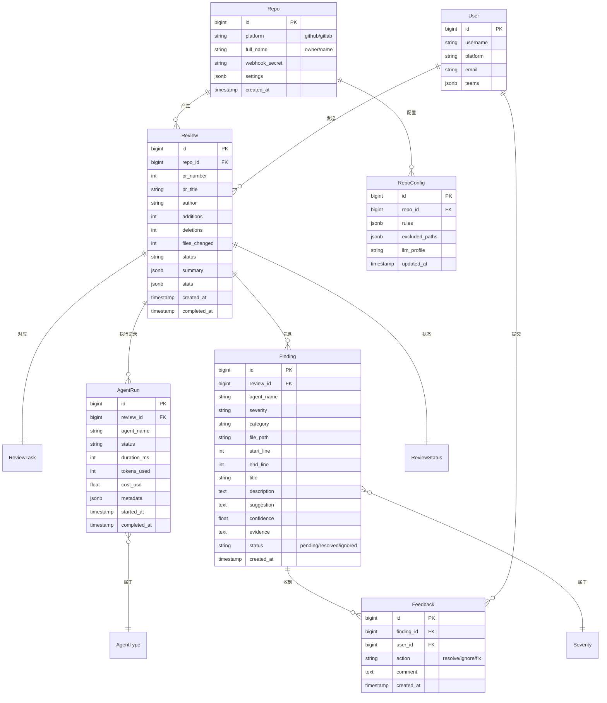

# 数据模型与 API 设计

> 文档版本：v0.1（设计阶段）
> 最后更新：2026-07-22
> 状态：待评审

## 目录

- [1. 数据模型 ER 设计](#1-数据模型-er-设计)
- [2. 核心领域模型](#2-核心领域模型)
- [3. 数据库 Schema](#3-数据库-schema)
- [4. REST API 设计](#4-rest-api-设计)
- [5. Webhook 接口规范](#5-webhook-接口规范)
- [6. CLI 接口规范](#6-cli-接口规范)

---

## 1. 数据模型 ER 设计

### 1.1 ER 图



### 1.2 实体说明

| 实体 | 职责 | 关键字段 |
|---|---|---|
| **Repo** | 被审查的代码仓库 | platform、full_name、settings |
| **Review** | 一次审查记录（一个 PR 可能多次） | pr_number、status、stats |
| **Finding** | 单条审查发现 | severity、location、suggestion |
| **Feedback** | 开发者对 Finding 的反馈 | action（resolve/ignore/fix） |
| **AgentRun** | 单个 Agent 执行记录 | duration、tokens、cost |
| **RepoConfig** | 仓库级配置 | rules、excluded_paths、llm_profile |

---

## 2. 核心领域模型

> 以下为 Python 领域模型（`core/models.py`），与 ORM 模型分离（DDD 原则）。

### 2.1 输入模型

```python
from pydantic import BaseModel, Field
from enum import Enum
from datetime import datetime


class Platform(str, Enum):
    GITHUB = "github"
    GITLAB = "gitlab"


class ReviewTask(BaseModel):
    """审查任务（队列中的消息体）。"""

    task_id: str
    repo_id: int
    platform: Platform
    repo_full_name: str          # owner/name
    pr_number: int
    pr_title: str
    pr_url: str
    author: str
    base_sha: str
    head_sha: str
    event_type: str              # opened/synchronize/reopened
    triggered_at: datetime
    triggered_by: str = "webhook"  # webhook/cli/api


class Diff(BaseModel):
    """代码变更。"""

    files: list["FileChange"]


class FileChange(BaseModel):
    """单个文件的变更。"""

    path: str
    old_path: str | None = None       # rename 场景
    status: str                       # added/modified/deleted/renamed
    additions: int
    deletions: int
    hunks: list["Hunk"]
    language: str | None = None       # 由 AST 引擎识别


class Hunk(BaseModel):
    """Diff 的一个变更块。"""

    old_start: int
    old_lines: int
    new_start: int
    new_lines: int
    content: str                      # 原始 diff 内容
    symbol: str | None = None         # 所属函数/类（AST 识别后填充）


class PrMetadata(BaseModel):
    """PR 元数据。"""

    number: int
    title: str
    description: str
    author: str
    base_branch: str
    head_branch: str
    labels: list[str]
    reviewers: list[str]
    commits: list[str]
```

### 2.2 上下文模型

```python
class CodeContext(BaseModel):
    """Agent 执行所需的上下文包。"""

    diff: Diff
    pr_metadata: PrMetadata
    full_files: dict[str, str] = Field(
        default_factory=dict,
        description="完整文件内容，path -> content"
    )
    related_symbols: list["SymbolInfo"] = Field(default_factory=list)
    call_graph: "CallGraph | None" = None
    repo_conventions: dict | None = None


class SymbolInfo(BaseModel):
    """代码符号信息（函数/类/方法）。"""

    name: str
    type: str                       # function/class/method/variable
    file_path: str
    start_line: int
    end_line: int
    signature: str | None = None
    docstring: str | None = None
```

### 2.3 输出模型

```python
class Severity(str, Enum):
    CRITICAL = "critical"    # 安全漏洞、数据丢失风险
    HIGH = "high"            # 明确的 Bug、严重性能问题
    MEDIUM = "medium"        # 潜在问题、可改进点
    LOW = "low"              # 轻微问题、建议
    INFO = "info"            # 提示性信息


class Category(str, Enum):
    SECURITY = "security"
    PERFORMANCE = "performance"
    CORRECTNESS = "correctness"      # 逻辑错误
    ARCHITECTURE = "architecture"    # 架构、设计
    TEST = "test"                    # 测试覆盖
    MAINTAINABILITY = "maintainability"
    DOCUMENTATION = "documentation"


class Finding(BaseModel):
    """单条审查发现（核心输出结构）。"""

    id: str                                  # UUID
    agent: str                               # 来源 Agent
    severity: Severity
    category: Category
    file_path: str
    start_line: int
    end_line: int
    title: str                               # 一句话总结
    description: str                         # 详细说明
    suggestion: str | None = None            # 修复建议（代码）
    evidence: str | None = None              # 推理证据链
    confidence: float = Field(ge=0.0, le=1.0)
    verified_by_tool: str | None = None      # 例如 "semgrep:python.lang.security.sqli"
    status: str = "pending"                  # pending/resolved/ignored/fixed


class ReviewSummary(BaseModel):
    """审查总结。"""

    overall_risk: Severity                   # 整体风险等级
    blockers: list[str]                      # 阻断性问题 ID
    walkthrough: str                         # PR 走查说明
    stats: "ReviewStats"


class ReviewStats(BaseModel):
    """审查统计。"""

    files_reviewed: int
    lines_reviewed: int
    agents_run: int
    duration_sec: float
    tokens_used: int
    cost_usd: float
    findings_by_severity: dict[str, int]
    findings_by_category: dict[str, int]


class ReviewResult(BaseModel):
    """审查最终输出。"""

    review_id: str
    task: ReviewTask
    findings: list[Finding]
    summary: ReviewSummary
    created_at: datetime
```

---

## 3. 数据库 Schema

### 3.1 PostgreSQL DDL（核心表）

```sql
-- 仓库表
CREATE TABLE repos (
    id              BIGSERIAL PRIMARY KEY,
    platform        VARCHAR(20) NOT NULL,          -- github/gitlab
    full_name       VARCHAR(255) NOT NULL,         -- owner/name
    external_id     VARCHAR(64),                   -- SCM 侧 ID
    webhook_secret  TEXT,
    default_branch  VARCHAR(255),
    settings        JSONB DEFAULT '{}',
    created_at      TIMESTAMPTZ DEFAULT NOW(),
    updated_at      TIMESTAMPTZ DEFAULT NOW(),
    UNIQUE(platform, full_name)
);
CREATE INDEX idx_repos_external ON repos(platform, external_id);


-- 审查记录表
CREATE TABLE reviews (
    id              BIGSERIAL PRIMARY KEY,
    repo_id         BIGINT NOT NULL REFERENCES repos(id),
    pr_number       INT NOT NULL,
    pr_title        TEXT,
    pr_url          TEXT,
    author          VARCHAR(255),
    base_sha        VARCHAR(40),
    head_sha        VARCHAR(40),
    status          VARCHAR(20) NOT NULL DEFAULT 'pending',
    -- pending/running/completed/failed/aborted
    additions       INT DEFAULT 0,
    deletions       INT DEFAULT 0,
    files_changed   INT DEFAULT 0,
    summary         JSONB,                         -- ReviewSummary
    stats           JSONB,                         -- ReviewStats
    triggered_by    VARCHAR(20) DEFAULT 'webhook',
    task_payload    JSONB,                         -- 原始任务（用于 replay）
    error_message   TEXT,
    created_at      TIMESTAMPTZ DEFAULT NOW(),
    started_at      TIMESTAMPTZ,
    completed_at    TIMESTAMPTZ
);
CREATE INDEX idx_reviews_repo_pr ON reviews(repo_id, pr_number);
CREATE INDEX idx_reviews_status ON reviews(status);
CREATE INDEX idx_reviews_created ON reviews(created_at DESC);


-- 审查发现表
CREATE TABLE findings (
    id              BIGSERIAL PRIMARY KEY,
    review_id       BIGINT NOT NULL REFERENCES reviews(id) ON DELETE CASCADE,
    finding_uuid    UUID NOT NULL UNIQUE,
    agent_name      VARCHAR(50) NOT NULL,
    severity        VARCHAR(20) NOT NULL,
    category        VARCHAR(30) NOT NULL,
    file_path       TEXT NOT NULL,
    start_line      INT NOT NULL,
    end_line        INT NOT NULL,
    title           TEXT NOT NULL,
    description     TEXT,
    suggestion      TEXT,
    evidence        TEXT,
    confidence      REAL NOT NULL,
    verified_by_tool TEXT,
    status          VARCHAR(20) DEFAULT 'pending',
    -- pending/resolved/ignored/fixed/wontfix
    scm_comment_id  VARCHAR(64),                   -- 对应 PR 评论 ID
    created_at      TIMESTAMPTZ DEFAULT NOW()
);
CREATE INDEX idx_findings_review ON findings(review_id);
CREATE INDEX idx_findings_severity ON findings(severity);
CREATE INDEX idx_findings_status ON findings(status);


-- 反馈表（用于持续学习）
CREATE TABLE feedbacks (
    id              BIGSERIAL PRIMARY KEY,
    finding_id      BIGINT NOT NULL REFERENCES findings(id) ON DELETE CASCADE,
    user_id         BIGINT REFERENCES users(id),
    action          VARCHAR(20) NOT NULL,          -- resolve/ignore/fix/wontfix
    comment         TEXT,
    created_at      TIMESTAMPTZ DEFAULT NOW()
);
CREATE INDEX idx_feedbacks_finding ON feedbacks(finding_id);


-- Agent 执行记录（成本/性能分析）
CREATE TABLE agent_runs (
    id              BIGSERIAL PRIMARY KEY,
    review_id       BIGINT NOT NULL REFERENCES reviews(id) ON DELETE CASCADE,
    agent_name      VARCHAR(50) NOT NULL,
    status          VARCHAR(20) NOT NULL,          -- success/failed/timeout
    duration_ms     INT,
    tokens_input    INT DEFAULT 0,
    tokens_output   INT DEFAULT 0,
    cost_usd        REAL DEFAULT 0,
    model_used      VARCHAR(100),
    metadata        JSONB,
    error_message   TEXT,
    started_at      TIMESTAMPTZ,
    completed_at    TIMESTAMPTZ
);
CREATE INDEX idx_agent_runs_review ON agent_runs(review_id);
CREATE INDEX idx_agent_runs_agent ON agent_runs(agent_name);


-- 仓库配置表
CREATE TABLE repo_configs (
    repo_id         BIGINT PRIMARY KEY REFERENCES repos(id) ON DELETE CASCADE,
    rules           JSONB DEFAULT '[]',            -- 自定义审查规则
    excluded_paths  JSONB DEFAULT '[]',            -- 排除的路径 glob
    included_severities JSONB DEFAULT '["critical","high","medium"]',
    llm_profile     VARCHAR(50) DEFAULT 'default', -- 模型配置 profile
    auto_post       BOOLEAN DEFAULT TRUE,
    updated_at      TIMESTAMPTZ DEFAULT NOW()
);


-- 用户表
CREATE TABLE users (
    id              BIGSERIAL PRIMARY KEY,
    username        VARCHAR(255) NOT NULL,
    platform        VARCHAR(20) NOT NULL,
    external_id     VARCHAR(64),
    email           TEXT,
    teams           JSONB DEFAULT '[]',
    created_at      TIMESTAMPTZ DEFAULT NOW(),
    UNIQUE(platform, external_id)
);


-- 审计日志（合规）
CREATE TABLE audit_logs (
    id              BIGSERIAL PRIMARY KEY,
    actor           VARCHAR(255) NOT NULL,
    action          VARCHAR(50) NOT NULL,          -- review.triggered/finding.resolved/...
    resource_type   VARCHAR(50),
    resource_id     VARCHAR(64),
    details         JSONB,
    ip_address      INET,
    created_at      TIMESTAMPTZ DEFAULT NOW()
);
CREATE INDEX idx_audit_logs_actor ON audit_logs(actor);
CREATE INDEX idx_audit_logs_created ON audit_logs(created_at DESC);
```

### 3.2 迁移策略

- 使用 **Alembic** 管理 schema 迁移
- 迁移脚本纳入版本控制，随代码一起发布
- 破坏性变更（删列/改类型）采用**双写过渡**：先加新列 → 双写 → 切读 → 删旧列

---

## 4. REST API 设计

### 4.1 设计规范

- **RESTful** 风格，资源命名复数
- 版本前缀：`/api/v1`
- 认证：Bearer Token（JWT）
- 分页：`?page=1&page_size=20`，响应含 `total`
- 错误格式：统一 RFC 7807 Problem Details

#### 统一错误响应

```json
{
  "type": "https://docs.example.com/errors/not-found",
  "title": "Resource Not Found",
  "status": 404,
  "detail": "Review 12345 not found",
  "request_id": "req-abc-123"
}
```

### 4.2 核心端点

#### 健康检查

```http
GET /health
```

```json
{
  "status": "healthy",
  "version": "0.1.0",
  "dependencies": {
    "postgres": "up",
    "redis": "up",
    "qdrant": "up"
  }
}
```

#### 触发审查

```http
POST /api/v1/reviews
Content-Type: application/json
Authorization: Bearer <token>

{
  "repo": "owner/name",
  "platform": "github",
  "pr_number": 123,
  "triggered_by": "api"
}
```

**响应**（202 Accepted）：

```json
{
  "review_id": 98765,
  "status": "pending",
  "estimated_duration_sec": 300,
  "poll_url": "/api/v1/reviews/98765"
}
```

#### 查询审查结果

```http
GET /api/v1/reviews/{review_id}
```

**响应**（200 OK）：

```json
{
  "review_id": 98765,
  "repo": "owner/name",
  "pr_number": 123,
  "status": "completed",
  "created_at": "2026-07-22T10:00:00Z",
  "completed_at": "2026-07-22T10:07:23Z",
  "summary": {
    "overall_risk": "medium",
    "blockers": ["finding-uuid-1"],
    "walkthrough": "本次变更新增了用户认证模块...",
    "stats": {
      "files_reviewed": 8,
      "lines_reviewed": 342,
      "agents_run": 4,
      "duration_sec": 443,
      "tokens_used": 45200,
      "cost_usd": 0.87,
      "findings_by_severity": {
        "critical": 0, "high": 1, "medium": 3, "low": 2
      }
    }
  },
  "findings_url": "/api/v1/reviews/98765/findings"
}
```

#### 查询审查发现

```http
GET /api/v1/reviews/{review_id}/findings?severity=high,medium&page=1
```

```json
{
  "total": 4,
  "page": 1,
  "page_size": 20,
  "items": [
    {
      "id": "finding-uuid-1",
      "agent": "security",
      "severity": "high",
      "category": "security",
      "file_path": "src/api/users.py",
      "start_line": 45,
      "end_line": 47,
      "title": "SQL 注入风险：用户输入未参数化",
      "description": "...",
      "suggestion": "db.query('SELECT * FROM users WHERE id = ?', [user_id])",
      "evidence": "调用栈: foo() -> bar() -> exec(raw_sql)",
      "confidence": 0.92,
      "verified_by_tool": "semgrep:python.lang.security.audit.sqli",
      "status": "pending"
    }
  ]
}
```

#### 提交反馈

```http
POST /api/v1/findings/{finding_id}/feedback
Authorization: Bearer <token>

{
  "action": "resolve",       // resolve/ignore/fix/wontfix
  "comment": "已修复"
}
```

#### 仓库配置

```http
GET /api/v1/repos/{platform}/{owner}/{name}/config
PUT /api/v1/repos/{platform}/{owner}/{name}/config
```

```json
{
  "rules": [
    {
      "id": "no-print-in-prod",
      "pattern": "print\\(",
      "severity": "low",
      "message": "生产代码不应包含 print"
    }
  ],
  "excluded_paths": ["**/*.generated.*", "vendor/**"],
  "included_severities": ["critical", "high", "medium"],
  "llm_profile": "cost_optimized",
  "auto_post": true
}
```

#### 统计与指标

```http
GET /api/v1/metrics?repo=owner/name&from=2026-07-01&to=2026-07-31
```

```json
{
  "total_reviews": 142,
  "total_findings": 387,
  "avg_duration_sec": 312,
  "total_cost_usd": 124.50,
  "precision_rate": 0.91,      // 基于 feedback 计算
  "top_categories": [
    {"category": "correctness", "count": 142},
    {"category": "security", "count": 89}
  ]
}
```

### 4.3 鉴权与权限

| 角色 | 权限 |
|---|---|
| **admin** | 全部操作，包括配置、查看所有仓库 |
| **maintainer** | 配置所属仓库、查看审查、处理反馈 |
| **developer** | 触发审查、查看自己 PR 的审查、提交反馈 |
| **viewer** | 只读 |

权限矩阵通过 RBAC 实现，详见 [SECURITY_AND_DEPLOYMENT.md](SECURITY_AND_DEPLOYMENT.md)。

---

## 5. Webhook 接口规范

### 5.1 GitHub Webhook

**端点**：`POST /webhooks/github`

**关键 Header**：
- `X-GitHub-Event: pull_request`
- `X-GitHub-Delivery: <uuid>`
- `X-Hub-Signature-256: sha256=<hmac>`

**处理事件**：
- `pull_request.opened` → 触发完整审查
- `pull_request.synchronize` → 增量审查（新 commit）
- `pull_request.reopened` → 触发审查
- `pull_request.closed` → 仅 merged 时记录
- `pull_request_review_comment` → 记录反馈
- `issue_comment` → 支持 `/review` 等斜杠命令

**验签示例**：

```python
import hmac, hashlib

def verify_github_signature(
    payload: bytes, signature: str, secret: str
) -> bool:
    expected = "sha256=" + hmac.new(
        secret.encode(), payload, hashlib.sha256
    ).hexdigest()
    return hmac.compare_digest(signature, expected)
```

### 5.2 GitLab Webhook

**端点**：`POST /webhooks/gitlab`

**关键 Header**：
- `X-Gitlab-Event: Merge Request Hook`
- `X-Gitlab-Token: <secret>`（配置的 Secret Token）
- `X-Gitlab-Webhook-UUID: <uuid>`

**处理事件**：
- `Merge Request Hook` → 根据 `object_attributes.action` 判断
  - `open` / `update` / `reopen` → 触发审查
  - `merge` / `close` → 仅记录
- `Note Hook` → 评论反馈

### 5.3 斜杠命令（通过评论触发）

```
/codereview                 # 触发审查
/codereview --agents security,performance  # 仅指定 Agent
/codereview --deep          # 深度审查（用强模型）
/codereview summary         # 重新生成 PR 摘要
```

---

## 6. CLI 接口规范

### 6.1 命令结构

```bash
code-review <command> [options]
```

| 命令 | 用途 |
|---|---|
| `review` | 审查代码变更 |
| `config` | 查看 / 修改配置 |
| `history` | 查询历史审查记录 |
| `login` | 登录 / 配置认证 |
| `agents` | 列出 / 启用禁用 Agent |

### 6.2 review 命令

```bash
# 审查当前分支相对 main 的变更
code-review review --base main

# 审查指定 PR
code-review review --pr 123 --repo owner/name --platform github

# 审查两个 commit 之间
code-review review --base sha-abc --head sha-def

# 审查暂存区
code-review review --staged

# 输出格式
code-review review --base main --format json   # JSON
code-review review --base main --format markdown > report.md
code-review review --base main --format sarif  # SARIF（CI 集成）

# 仅指定 Agent
code-review review --base main --agents security,performance

# 输出到文件
code-review review --base main --output report.json
```

### 6.3 退出码（CI 集成）

| 退出码 | 含义 |
|---|---|
| 0 | 审查成功，无 critical/high 问题 |
| 1 | 审查成功，但存在 critical/high 问题 |
| 2 | 配置错误 |
| 3 | 认证失败 |
| 4 | 网络错误 |
| 5 | 内部错误 |

---

## 附录

### A. SARIF 输出支持

SARIF（Static Analysis Results Interchange Format）是 OASIS 标准，可被 GitHub Code Scanning 原生消费：

```bash
code-review review --base main --format sarif > results.sarif
```

上传到 GitHub 后会显示在仓库的 Security 标签页。

### B. API 限流

- 默认每 token 60 req/min
- 触发审查接口：每 token 10 req/min
- 超限返回 429 + `Retry-After` Header

---

**下一步**：评审本设计 → 修订 → 进入 [Prompt 设计](PROMPT_DESIGN.md)。
