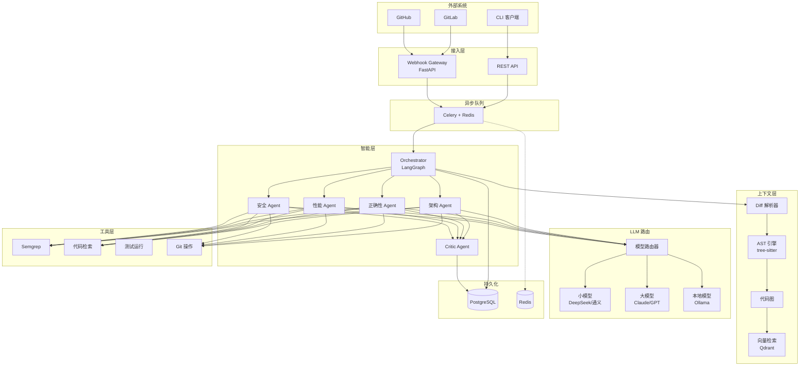
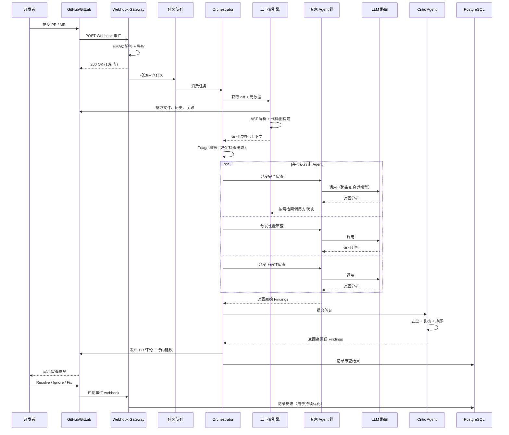
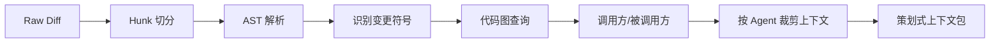

# 系统设计文档

> 文档版本：v0.1（设计阶段）
> 最后更新：2026-07-22
> 状态：待评审

## 目录

- [1. 设计目标与范围](#1-设计目标与范围)
- [2. 设计原则](#2-设计原则)
- [3. 系统总体架构](#3-系统总体架构)
- [4. 端到端工作流](#4-端到端工作流)
- [5. 模块详细设计](#5-模块详细设计)
- [6. 关键技术决策](#6-关键技术决策)
- [7. 模块依赖关系](#7-模块依赖关系)
- [8. 错误处理与容错](#8-错误处理与容错)
- [9. 性能与扩展性](#9-性能与扩展性)

---

## 1. 设计目标与范围

### 1.1 业务目标

| 目标 | 衡量指标 | 目标值 |
|---|---|---|
| **降低 PR 等待时间** | PR 从提交到首次审查响应 | P95 < 10 分钟 |
| **提升审查有效性** | 提出的问题中真实问题占比（精确率） | > 90% |
| **覆盖深度问题** | 跨文件、架构级问题占比 | > 30% |
| **降低单 PR 成本** | LLM token 成本 | < $5 / PR |
| **研发采纳率** | 团队 PR 中启用审查的比例 | > 80% |

### 1.2 范围（In Scope）

- GitHub Pull Request 与 GitLab Merge Request 的自动审查
- 多语言代码审查（Python / Java / TypeScript / Go / JavaScript 等）
- PR 评论、行内建议、严重度分级
- 多模型路由（云端 + 本地 LLM）
- 团队规则定制与反馈学习
- 私有化部署能力

### 1.3 不在范围内（Out of Scope，YAGNI）

- ❌ IDE 插件（Phase 3+ 再考虑）
- ❌ 多租户 SaaS 计费
- ❌ 自动修复并直接提交代码（保留人类决策权）
- ❌ 代码生成 / 补全（与 Copilot 类工具边界清晰）
- ❌ 非 Git 平台（SVN 等暂不支持）

---

## 2. 设计原则

### 2.1 工程原则

| 原则 | 应用 |
|---|---|
| **KISS** | MVP 阶段单 Agent 即可；能用标准库解决的不引入第三方 |
| **YAGNI** | 不预留未明确需要的接口；过度设计比代码重复危害更大 |
| **DRY** | SCM Provider、LLM Provider、Tool 统一抽象 |
| **SOLID** | 模块划分遵循单一职责；依赖抽象而非具体实现 |
| **OCP** | Agent、Tool、Rule 通过注册机制扩展 |

### 2.2 产品原则

| 原则 | 理由 |
|---|---|
| **精确率 > 召回率** | 误报是 AI 审查被关闭的第一原因；只报高置信度问题 |
| **聚焦逻辑错误** | 样式问题交给 linter；Agent 专注于逻辑、安全、架构 |
| **人在环中** | 永不自动 approve / merge；保留人类最终决策权 |
| **可解释性** | 每个 Finding 附带推理链与代码证据，建立信任 |
| **延迟容忍** | Code Review 非实时任务，可接受 5–10 分钟换取深度 |

---

## 3. 系统总体架构

### 3.1 分层架构

系统采用 **5 层架构**，每层职责单一、依赖单向（上层依赖下层抽象）：

```
┌────────────────────────────────────────────────────────────────┐
│                     接入层 (Ingestion)                          │
│   Webhook Gateway · CLI · API · 异步队列触发                    │
│   职责：验签、鉴权、10s 内响应、任务入队                        │
├────────────────────────────────────────────────────────────────┤
│                     过滤层 (Triage)                             │
│   噪音过滤 · 快慢队列分流 · PR 粗筛摘要                        │
│   职责：砍掉 40% 噪音 PR、决定检查策略                         │
├────────────────────────────────────────────────────────────────┤
│                     上下文层 (Context Engine)                   │
│   Diff 解析 · Tree-sitter AST · 代码图 · 向量检索              │
│   职责：为 Agent 准备精确、最小化的上下文                       │
├────────────────────────────────────────────────────────────────┤
│                     智能层 (Intelligence)                       │
│   Orchestrator · 专家 Agent · Critic · Tool 调用               │
│   职责：多 Agent 并行分析、发现验证、结果聚合                   │
├────────────────────────────────────────────────────────────────┤
│                     输出层 (Output)                             │
│   结构化 Finding · PR 评论 · 状态检查 · 反馈记录               │
│   职责：呈现结果、收集反馈、形成闭环                            │
└────────────────────────────────────────────────────────────────┘

横向支撑：
┌───────────────┬───────────────┬───────────────┬───────────────┐
│  LLM 路由层   │  持久化层     │  沙箱层       │  可观测性层   │
│  LiteLLM      │  PostgreSQL  │  Docker       │  日志/指标/   │
│  多模型路由    │  Redis       │  隔离执行     │  链路追踪     │
└───────────────┴───────────────┴───────────────┴───────────────┘
```

### 3.2 组件视图



### 3.3 物理部署视图

```
┌─────────────────────────────────────────────────────┐
│                 Kubernetes Cluster                   │
│                                                      │
│  ┌──────────┐  ┌──────────┐  ┌──────────────────┐  │
│  │ Ingress  │→ │ API Pods │→ │ Worker Pods (xN) │  │
│  │ Nginx    │  │ FastAPI  │  │ Celery Workers   │  │
│  └──────────┘  └──────────┘  └──────────────────┘  │
│                      ↓                 ↓             │
│              ┌───────────────────────────────┐      │
│              │       基础设施服务            │      │
│              │  PostgreSQL · Redis · Qdrant  │      │
│              └───────────────────────────────┘      │
│                                                      │
│  ┌──────────────────┐  ┌──────────────────────┐    │
│  │ Docker Runtime   │  │ LLM Gateway          │    │
│  │ 沙箱执行环境     │  │ LiteLLM / 自建代理    │    │
│  └──────────────────┘  └──────────────────────┘    │
└─────────────────────────────────────────────────────┘
            ↓                           ↓
    ┌───────────────┐         ┌──────────────────┐
    │ GitHub/GitLab │         │ LLM Providers    │
    │   Webhook     │         │ Claude/GPT/...   │
    └───────────────┘         └──────────────────┘
```

---

## 4. 端到端工作流

### 4.1 主流程时序图



### 4.2 关键流程说明

#### 4.2.1 Webhook 接收（10 秒约束）

GitHub/GitLab Webhook 要求 **10 秒内**响应，而完整审查需要 5–10 分钟。必须采用**异步队列模式**：

1. Gateway 收到 Webhook → HMAC 验签 → 写入队列 → 立即返回 200
2. Worker 异步消费，完成审查后通过 SCM API 回写评论
3. 失败重试由队列层保证（指数退避，最多 3 次）

#### 4.2.2 Triage 粗筛（成本控制关键）

并非所有 PR 都需要深度审查。粗筛策略：

| PR 类型 | 处理方式 |
|---|---|
| 仅文档变更（*.md） | 跳过，仅生成摘要 |
| 仅依赖锁文件（lockfile） | 跳过 |
| Bot 提交（dependabot 等） | 轻量审查，仅查安全问题 |
| 纯格式化 / 自动生成代码 | 跳过 |
| 变更 < 20 行且单文件 | 单模型快速审查 |
| 变更 > 500 行 / > 20 文件 | 多 Agent 深度审查 + Map-Reduce |
| 其他 | 标准多 Agent 审查 |

#### 4.2.3 上下文构建（质量核心）



**核心思想**：每个 Agent 只拿到与其职责相关的最小上下文，避免上下文稀释。

#### 4.2.4 多 Agent 并行执行

- 使用 LangGraph 的并行节点能力
- 每个 Agent 独立上下文、独立 LLM 调用、独立工具集
- 失败的 Agent 不影响其他 Agent（fail-isolation，需自研封装层，见 5.4.4）
- 超时自动终止（单 Agent 超时 3 分钟）

#### 4.2.5 Critic 验证层（降误报核心）

```
原始 Findings (来自多 Agent)
    │
    ▼
┌─────────────────────┐
│ 1. 去重             │ ← 跨 Agent 可能发现相同问题
│ 2. 规则过滤         │ ← 已知误报模式库
│ 3. 工具实证校验     │ ← 用静态分析/检索验证假设
│ 4. 置信度评分       │ ← 低置信度（<0.5）丢弃
│ 5. 严重度排序       │ ← 高/中/低/信息
└─────────────────────┘
    │
    ▼
高置信 Findings → 发布
```

> **⚠️ Spike 实测发现**：LangGraph 的状态字段 reducer 是"累加"语义，无法用同名字段实现"覆盖"。因此 Critic 节点必须使用**独立字段**：
> - Agent 输出：`raw_findings`（累加 reducer）
> - Critic 输出：`verified_findings`（覆盖语义，用 `last_value` 默认 reducer）
> - 发布节点读取：`verified_findings`

---

## 5. 模块详细设计

### 5.1 接入层（Ingestion）

#### 5.1.1 Webhook Gateway

```python
# 接口定义
class WebhookHandler(Protocol):
    async def handle_github_webhook(
        self, event: str, payload: dict, signature: str
    ) -> WebhookResponse: ...

    async def handle_gitlab_webhook(
        self, event: str, payload: dict, token: str
    ) -> WebhookResponse: ...
```

**职责**：
- HMAC / Token 验签（防止伪造）
- 鉴权（仓库白名单）
- 事件类型过滤（仅处理 `pull_request` / `merge_request`）
- 任务序列化并投递到队列
- **10s 内返回**（不阻塞）

**关键设计**：
- 幂等性：基于 `event_id + repo + pr_id` 去重，防止 Webhook 重复投递
- 背压：队列满时返回 429，让 SCM 重试

#### 5.1.2 REST API

供 CLI / 前端 / 第三方调用，详见 [DATA_AND_API.md](DATA_AND_API.md)。

#### 5.1.3 CLI

```bash
# 本地审查当前分支的 diff
code-review review --base main --head feature-x

# 审查指定 PR
code-review review --pr 123 --repo owner/name

# 输出 JSON 报告
code-review review --base main --format json > report.json
```

### 5.2 SCM Provider 层（DRY 抽象）

```python
# 统一抽象（依赖倒置）
class ScmProvider(Protocol):
    """SCM 平台统一抽象，屏蔽 GitHub/GitLab 差异。"""

    @property
    def platform(self) -> Literal["github", "gitlab"]: ...

    def get_pr_metadata(self, repo: str, pr_id: int) -> PrMetadata: ...
    def get_diff(self, repo: str, pr_id: int) -> Diff: ...
    def get_file_content(self, repo: str, path: str, ref: str) -> str: ...
    def post_review_comment(
        self, repo: str, pr_id: int, finding: Finding
    ) -> CommentRef: ...
    def update_pr_status(
        self, repo: str, pr_id: int, status: ReviewStatus
    ) -> None: ...
    def list_reviews(self, repo: str, pr_id: int) -> list[Review]: ...
```

**实现**：
- `GitHubProvider`：基于 `PyGithub` 或 `httpx` 直连 REST API
- `GitLabProvider`：基于 `python-gitlab`
- 通过工厂模式 + 配置切换：`ScmProviderFactory.create(platform=...)`

### 5.3 上下文引擎（Context Engine）

#### 5.3.1 Diff 解析器

```python
class DiffParser:
    """解析 unified diff，按语义边界切分。"""

    def parse(self, raw_diff: str) -> list[FileChange]:
        """返回按文件组织的变更列表。"""

    def split_by_symbol(self, file_change: FileChange) -> list[Hunk]:
        """基于 AST 将 hunk 按函数/类边界切分。"""
```

#### 5.3.2 AST 引擎

```python
class AstEngine:
    """基于 tree-sitter 的多语言 AST 引擎。"""

    SUPPORTED_LANGUAGES = {
        "python", "java", "typescript", "javascript",
        "go", "rust", "c", "cpp",
    }

    def parse(self, code: str, language: str) -> Tree: ...
    def find_function(self, tree: Tree, name: str) -> Node | None: ...
    def get_symbol_at_line(self, tree: Tree, line: int) -> SymbolInfo: ...
    def extract_call_graph(self, tree: Tree) -> CallGraph: ...
```

#### 5.3.3 代码图

```python
class CodeGraph:
    """仓库级代码图：函数/类/调用关系。"""

    def build(self, repo_path: Path) -> None: ...
    def find_usages(self, symbol: str) -> list[Location]: ...
    def get_callers(self, function: str) -> list[Location]: ...
    def get_callees(self, function: str) -> list[Location]: ...
    def find_similar_implementations(self, code: str) -> list[Location]: ...
```

#### 5.3.4 向量检索（RAG）

```python
class CodeVectorStore:
    """基于 Qdrant 的代码语义检索。"""

    def index_repo(self, repo_path: Path) -> None: ...
    def search(self, query: str, top_k: int = 5) -> list[CodeSnippet]: ...
    def search_similar(self, snippet: CodeSnippet) -> list[CodeSnippet]: ...
```

**注意**：RAG 仅作为**辅助手段**，不能替代代码图。纯向量检索在代码场景精度有限（业界共识）。

### 5.4 智能层（Intelligence）

#### 5.4.1 Orchestrator（编排器）

```python
class ReviewOrchestrator:
    """顶层编排器，基于 LangGraph 实现 Plan-and-Execute 流程。"""

    def __init__(
        self,
        context_engine: ContextEngine,
        agent_registry: AgentRegistry,
        critic: CriticAgent,
        llm_router: LlmRouter,
    ): ...

    async def review(self, task: ReviewTask) -> ReviewResult:
        """
        端到端审查流程：
        1. 构建上下文
        2. Triage 决策
        3. 分发专家 Agent（并行）
        4. Critic 验证
        5. 输出结构化结果
        """
```

**LangGraph 状态机定义**：

```python
from langgraph.graph import StateGraph

graph = StateGraph(ReviewState)
graph.add_node("fetch_context", fetch_context_node)
graph.add_node("triage", triage_node)
graph.add_node("parallel_review", parallel_review_node)  # 并行 fan-out
graph.add_node("aggregate", aggregate_node)
graph.add_node("critic", critic_node)
graph.add_node("publish", publish_node)

graph.add_edge("fetch_context", "triage")
graph.add_conditional_edges(
    "triage",
    route_by_strategy,  # 决定执行哪些 Agent
    ["parallel_review", "publish"],  # 噪音 PR 直接跳过
)
graph.add_edge("parallel_review", "aggregate")
graph.add_edge("aggregate", "critic")
graph.add_edge("critic", "publish")
```

#### 5.4.2 专家 Agent（Specialized Agents）

```python
class ReviewAgent(Protocol):
    """专家 Agent 抽象。"""

    name: str  # e.g. "security", "performance"
    role: str  # Agent 角色，用于 Prompt
    tools: list[Tool]  # 可调用的工具集

    async def review(
        self, context: AgentContext
    ) -> list[Finding]: ...


class SecurityAgent(ReviewAgent):
    """安全审查专家：OWASP Top 10、注入、权限、敏感信息。"""
    name = "security"
    tools = [semgrep_tool, search_code_tool, find_usages_tool]


class PerformanceAgent(ReviewAgent):
    """性能审查专家：N+1、复杂度、资源泄漏。"""
    name = "performance"
    tools = [search_code_tool, find_usages_tool]


class CorrectnessAgent(ReviewAgent):
    """正确性专家：边界条件、并发、异常处理。"""
    name = "correctness"


class ArchitectureAgent(ReviewAgent):
    """架构专家：分层、耦合、设计模式一致性。"""
    name = "architecture"
```

**扩展机制（OCP）**：通过 `AgentRegistry` 注册新 Agent，无需修改 Orchestrator：

```python
@agent_registry.register("test_quality")
class TestQualityAgent(ReviewAgent):
    ...
```

#### 5.4.4 错误隔离封装（Spike 验证必要）

LangGraph 默认行为是任一节点失败即终止整个图。要做到 **fail-isolation**（单 Agent 失败不影响整体），必须自研装饰器：

```python
import functools
import logging
from typing import Callable

logger = logging.getLogger(__name__)


def agent_safe_run(func: Callable) -> Callable:
    """Agent 节点装饰器：捕获所有异常，转为错误记录。"""

    @functools.wraps(func)
    async def wrapper(state: dict) -> dict:
        try:
            return await func(state)
        except Exception as e:
            agent_name = getattr(func, "_agent_name", func.__name__)
            logger.exception(f"Agent {agent_name} failed: {e}")
            # 返回空 findings + 错误记录，不抛异常
            errors = state.get("errors", [])
            errors.append({
                "agent": agent_name,
                "error": str(e),
                "type": type(e).__name__,
            })
            return {"errors": errors}  # 不写入 raw_findings，实现隔离

    return wrapper


# 使用方式
@agent_safe_run
async def security_agent(state: ReviewState) -> dict:
    ...
```

**配合超时控制**：

```python
import asyncio

async def with_timeout(coro, seconds: int = 180):
    """带超时的 Agent 执行。"""
    try:
        return await asyncio.wait_for(coro, timeout=seconds)
    except asyncio.TimeoutError:
        raise AgentError(f"Agent timed out after {seconds}s")
```

#### 5.4.3 Critic Agent（验证层）

```python
class CriticAgent:
    """对原始 Findings 做去重、验证、排序。"""

    async def verify(
        self, findings: list[Finding], context: ReviewContext
    ) -> list[Finding]:
        """
        1. 跨 Agent 去重（相同位置 + 相同问题类型）
        2. 工具实证校验（可选，高成本发现才校验）
        3. 置信度评分（< 阈值丢弃）
        4. 严重度规范化
        """
```

### 5.5 LLM 路由层

```python
class LlmRouter:
    """多模型路由：基于任务复杂度选择模型。"""

    ROUTING_RULES = {
        "triage": "deepseek-chat",          # 粗筛用便宜模型
        "summary": "deepseek-chat",         # PR 摘要用便宜模型
        "specialist_quick": "qwen-plus",    # 快速审查
        "specialist_deep": "claude-opus",   # 深度审查用强模型
        "critic": "claude-sonnet",          # Critic 用中等模型
    }

    async def complete(
        self,
        messages: list[Message],
        task_type: str,
        **kwargs,
    ) -> LlmResponse:
        model = self.select_model(task_type, messages)
        return await self.client.complete(model, messages, **kwargs)

    def select_model(self, task_type: str, messages: list) -> str:
        """根据任务类型 + token 长度选择最合适的模型。"""
        ...
```

**关键策略**：
- **Prompt 缓存**：相同仓库的 system prompt 复用，节省 30–40% 成本
- **降级策略**：主模型不可用时降级到备选（claude → gpt → deepseek）
- **预算控制**：单 PR token 预算上限，超额时停止深度审查

### 5.6 工具层（Tool）

```python
# 工具基类
class Tool(Protocol):
    name: str
    description: str

    async def run(self, **kwargs) -> ToolResult: ...


# 内置工具集
class SearchCodeTool(Tool):
    """在仓库中搜索代码模式。"""

class FindUsagesTool(Tool):
    """查找符号的所有引用（基于代码图）。"""

class RunSemgrepTool(Tool):
    """运行 Semgrep 静态分析。"""

class GetFileContentTool(Tool):
    """读取仓库中的文件内容。"""

class GitHistoryTool(Tool):
    """查询 Git 历史（blame/log）。"""

class RunTestsTool(Tool):
    """在沙箱中运行测试（可选，需额外授权）。"""
```

**工具设计原则**：
- **最小权限**：工具默认只读；写操作（如运行测试）需显式授权
- **确定性优先**：能用代码图/正则解决的不用 LLM
- **沙箱隔离**：所有代码执行在 Docker 容器内

---

## 6. 关键技术决策

### 6.1 决策记录（ADR 摘要）

| # | 决策 | 选项 | 结论 | 理由 |
|---|---|---|---|---|
| 1 | Agent 编排框架 | LangGraph / AutoGen / CrewAI / 自研 | **LangGraph** | 生产级、有状态图、检查点恢复、社区活跃 |
| 2 | 多模型调用 | LangChain / LiteLLM / 直连 SDK | **LiteLLM**（固定 `>=1.50,<1.60`） | 统一 100+ 模型接口、路由能力强、与 LangGraph 解耦。⚠️ Spike 实测：1.60+ 在 Windows 有 Rust 编译依赖问题；1.x 在 Python 3.13 需 `legacy-cgi` 兜底（cgi 被 PEP 594 移除） |
| 3 | Agent 范式 | 单 Agent / 多 Agent | **多 Agent**（Phase 2+） | 上下文稀释严重；分角色降误报 |
| 4 | 代码解析 | 正则 / ctags / tree-sitter | **tree-sitter** | 多语言、增量解析、AST 完整 |
| 5 | 持久化 | MySQL / PostgreSQL | **PostgreSQL** | JSONB、pgvector 扩展、成熟稳定 |
| 6 | 队列 | Celery / Dramatiq / RQ / Kafka | **Celery + Redis**（MVP）→ Kafka（规模化） | 生态成熟、团队熟悉；规模大时切换 |
| 7 | 沙箱 | subprocess / Docker / Firecracker | **Docker**（MVP） | 隔离充分、SDK 成熟；极致性能再考虑 microVM |
| 8 | 输出位置 | PR 评论 / 状态检查 / 外部报告 | **PR 行内评论 + 摘要** | 最直观、可逐条讨论 |

### 6.2 反模式（明确不做）

| ❌ 不做 | 理由 |
|---|---|
| 单 Prompt 塞所有规则 | 上下文稀释，误报飙升 |
| 自动 approve PR | 违反"人在环中"原则 |
| 对每个文件都跑全量 Agent | 成本爆炸 |
| 用 LLM 做格式检查 | linter 一行命令搞定 |
| 在 Orchestrator 里硬编码 Agent 列表 | 违反 OCP，无法扩展 |

---

## 7. 模块依赖关系

### 7.1 依赖方向（单向）

```
接入层 ──────→ 智能层 ──────→ 输出层
  │              ↑               │
  │              │               │
  └──→ 队列 ─────┘               │
                 │               │
                 ↓               │
            上下文层              │
                 │               │
                 ↓               │
            LLM 路由              │
             工具层               │
                 │               │
                 ↓               │
             持久化 ←────────────┘
```

**规则**：
- 上层依赖下层抽象（接口），不依赖具体实现
- 同层模块之间通过事件 / 队列解耦
- 跨层调用必须经过明确的接口定义

### 7.2 包结构（目录规范）

```
code_review_agent/
├── adapters/                 # 适配器层（对接外部系统）
│   ├── scm/                  # SCM Provider
│   │   ├── base.py           # ScmProvider 抽象
│   │   ├── github.py
│   │   ├── gitlab.py
│   │   └── factory.py
│   ├── llm/                  # LLM Provider
│   │   ├── router.py
│   │   └── providers/
│   └── webhook/              # Webhook 处理
│
├── core/                     # 核心领域模型（无外部依赖）
│   ├── models.py             # Diff / Finding / ReviewTask 等
│   ├── errors.py             # 统一异常体系
│   └── types.py              # 类型定义
│
├── context/                  # 上下文引擎
│   ├── diff_parser.py
│   ├── ast_engine.py
│   ├── code_graph.py
│   └── vector_store.py
│
├── agents/                   # Agent 层
│   ├── base.py               # ReviewAgent 抽象基类
│   ├── registry.py           # Agent 注册中心
│   ├── orchestrator.py       # LangGraph 编排器
│   ├── critic.py             # Critic 验证 Agent
│   └── specialists/          # 专家 Agent
│       ├── security.py
│       ├── performance.py
│       ├── correctness.py
│       └── architecture.py
│
├── tools/                    # Agent 可调用工具
│   ├── base.py
│   ├── search_code.py
│   ├── find_usages.py
│   ├── semgrep.py
│   └── git_history.py
│
├── api/                      # REST API
│   ├── routes/
│   └── schemas/
│
├── workers/                  # Celery Worker
│   ├── tasks.py
│   └── celery_app.py
│
├── storage/                  # 持久化
│   ├── db.py
│   ├── models/               # ORM 模型
│   └── repositories/         # Repository 模式
│
├── sandbox/                  # 沙箱执行
│   └── docker_runner.py
│
├── cli/                      # 命令行工具
│   └── main.py
│
├── config/                   # 配置
│   ├── settings.py
│   └── logging.py
│
└── observability/            # 可观测性
    ├── metrics.py
    ├── tracing.py
    └── audit.py
```

**依赖规则**（通过 lint 强制）：
- `core/` 不得 import 其他任何包
- `adapters/` 不得 import `agents/` / `api/`
- `agents/` 可 import `core/` / `context/` / `tools/` / `adapters/`
- `api/` / `workers/` / `cli/` 是入口，可 import 任何包

---

## 8. 错误处理与容错

### 8.1 异常体系

```python
class CodeReviewError(Exception):
    """所有自定义异常的基类。"""

class ScmError(CodeReviewError):
    """SCM 平台相关错误（API 失败、权限不足等）。"""

class LlmError(CodeReviewError):
    """LLM 调用错误（超时、限流、上下文超限等）。"""

class ContextError(CodeReviewError):
    """上下文构建错误（AST 解析失败、文件过大等）。"""

class AgentError(CodeReviewError):
    """Agent 执行错误。"""

class ReviewAbortedError(CodeReviewError):
    """审查被中止（预算超限、致命错误等）。"""
```

### 8.2 容错策略

| 故障点 | 影响 | 容错策略 |
|---|---|---|
| Webhook 重复投递 | 重复审查 | 幂等性去重（event_id） |
| SCM API 限流 | 拉取失败 | 指数退避重试（最多 3 次） |
| LLM 超时 / 限流 | Agent 失败 | 降级到备选模型；单 Agent 失败不影响整体 |
| AST 解析失败 | 上下文缺失 | 降级为纯 diff 审查，记录告警 |
| 单 Agent 异常 | 部分能力缺失 | fail-isolation，其他 Agent 继续 |
| 队列消费失败 | 任务卡住 | 死信队列 + 告警 |
| 预算超限 | 成本失控 | 软中断，输出已完成的部分结果 |

### 8.3 重试与超时

```python
# 统一的重试装饰器
@retry(
    stop=stop_after_attempt(3),
    wait=wait_exponential(multiplier=1, min=4, max=60),
    retry=retry_if_exception_type((TimeoutError, RateLimitError)),
)
async def call_llm(...): ...

# 超时配置
TIMEOUTS = {
    "scm_api": 30,          # SCM API 调用
    "llm_call": 120,        # 单次 LLM 调用
    "single_agent": 180,    # 单个 Agent 执行
    "whole_review": 900,    # 整个审查（15 分钟）
}
```

---

## 9. 性能与扩展性

### 9.1 性能目标

| 指标 | 目标 | 说明 |
|---|---|---|
| Webhook 响应 | < 1s | Gateway 处理时间 |
| 小 PR 审查 | < 3 min | < 20 行变更 |
| 中 PR 审查 | < 8 min | 20–500 行 |
| 大 PR 审查 | < 15 min | > 500 行（Map-Reduce） |
| 单 PR token 成本 | < $5 | 多模型路由后 |

> **📊 Spike 实测数据**（2026-07-23）：
> - **tree-sitter 解析**：3850 行代码 10.2ms（**378,967 行/秒**），远超预期
> - **多 Agent 并行**：3 个 Agent 并行 462ms vs 串行 1050ms（**提速 56%**）
> - **符号级提取**：按函数提取可节省 **93.3% token**（成本控制关键技术）
> - **端到端集成**：7 个函数 + 3 Agent 审查，mock 模式下 **7ms** 完成

### 9.2 扩展性设计

#### 水平扩展

- **Worker 无状态**：所有状态在 PostgreSQL / Redis，Worker 可随意扩缩
- **队列分区**：按仓库 hash 分区，保证同仓库任务有序
- **LLM 调用并发**：通过信号量限制单 Worker 的并发 LLM 调用数

#### 性能优化手段

| 手段 | 收益 | 适用 |
|---|---|---|
| 多 Agent 并行 | 延迟降 60% | 所有多 Agent 场景 |
| Prompt 缓存 | 成本降 30–40% | 相同仓库重复审查 |
| AST-aware 精简 | token 降 70% | 大文件审查 |
| 模型路由 | 成本降 50%+ | 所有场景 |
| 增量审查 | 延迟降 50% | 新 commit 推送时 |
| 向量检索预热 | 延迟降 20% | 首次审查大仓库 |

### 9.3 容量规划（参考）

| 规模 | 日均 PR | Worker 数 | LLM 月成本（估） |
|---|---|---|---|
| 小团队 | 50 | 2 | $500 |
| 中等团队 | 500 | 5–10 | $5,000 |
| 大型团队 | 2000+ | 20+ | $20,000+ |

---

## 附录

### A. 术语表

| 术语 | 含义 |
|---|---|
| PR / MR | Pull Request / Merge Request |
| Diff | 代码变更差异 |
| Hunk | Diff 中的一个连续变更块 |
| Finding | 审查发现的一条问题 |
| Critic | 验证层 Agent，过滤误报 |
| Triage | 粗筛、分流 |
| GraphRAG | 基于代码图的检索增强生成 |

### B. 参考资料

- [调研报告汇总](../)（见项目对话记录）
- [LangGraph 文档](https://langchain-ai.github.io/langgraph/)
- [LiteLLM 文档](https://docs.litellm.ai/)
- [tree-sitter 文档](https://tree-sitter.github.io/tree-sitter/)

---

**下一步**：评审本设计 → 修订 → 进入 [实施路线](IMPLEMENTATION_ROADMAP.md) Phase 1。
